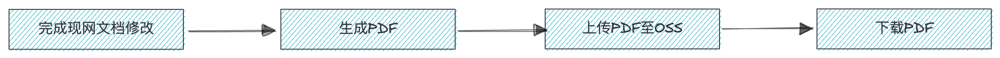

## 前情提要

前几天刷知乎刷到了一个问题：你见过哪些让你目瞪口呆的 bug？我一下子就想到了之前还在 Rancher 的时候，在使用 `npx docusaurus-pdf` 生成 PDF 文件的过程中碰到的问题。

## 初识 docusaurus-pdf

使用 `docusaurus-pdf` 生成 PDF 文件的原因非常简单，老板是 sales 出身，他希望能提供 PDF 下载这个选项，让有需要的人在内网和离线环境也可以看文档。其次，下载 PDF 要提供一些简单的个人信息，可以用这些信息去找到潜在的付费用户。基于以上这两个原因，我们就有了 PDF 文档这个需求。实现这个需求的方式也十分简单，大致分为以下几步。

1. 通过 GitHub 完成现网文档更新。
1. 使用 `docusaurus-pdf` 命令生成 PDF 文件。
1. 将新的 PDF 文件上传至 OSS。
1. 填写信息并下载 PDF。



整个过程其实非常简单，关键就是使用 `docusaurus-pdf` 命令生成文件这一步。刚开始使用的时候其实我也不太懂这行命令是干啥的，能满足需求，冲就完事了。

它的完整形态是这样的：

```shell
npx docusaurus-pdf <initialDocsUrl> [filename]
```

其中： 

- `<initialDocsUrl>` 是网页链接，是整个 PDF 的第一页，可以是现网地址 `www.xxx.example`，也可以是本地环境 `localhost:3000`。
- `[filename]` 是生成 PDF 的文件名，文件会保存在当前所处的路径下。

举个例子：

```shell
npx docusaurus-pdf https://docs.rancher.cn/docs/rancher2.5/_index/ rancherdocs_2.5
```

会在我现在的路径下生成一份 `rancherdocs_2.5.pdf`，包含了 Rancher 2.5 的所有文档内容。

## docusaurus-pdf 的工作原理

`docusaurus-pdf` 的工作原理可以说是极致的简单粗暴：根据导航栏的排列顺序，自动点击每一个页面下方的“下一页”按键，并生成 PDF，直到最后一页没有“下一页”这个按键为止。你可以把它理解为一个**有限的** for loop 循环吧。

## docusaurus-pdf 的弊端

毋庸置疑的是 `docusaurus-pdf` 为我们提供了相当大程度上的便利，但它也有一些弊端，其中最大的一个弊端是只能通过 `<initialDocsUrl>` 指定起始页，而**没有办法指定终止页**。这个问题带来了一些困扰：在我的设想中，既然可以生成一份完整版的 PDF， 那就应该可以更进一步完善，例如根据手册和层级分类，生成完整版的子集，这样用户可以更加方便地各取所需。正是因为无法指定终止页，如果坚持要提供不同的手册，那么就会增加非常大的工作量。说实话，这并不是做不到，而是每个月的下载数量并不足以让我花很多时间去做。假设从无到有提供 PDF 是 80 分的话，那提供分类下载肯定是 100 分，但是为了这额外的 20 分，我的工作量加了不止一个数量级，何况每个版本都要做一次，深思熟虑之后，我们一致决定现在提供一整份就可以了。


## 触发 docusaurus-pdf 无限循环问题的起因

起因是我当时想做一些优化，通过百度监控我知道了用户经常访问一些页面，但这些页面由于历史原因，藏在很深的层级目录里面（能改，但会给自己挖深坑，所以我没动它们），很难找到。我就想说，要是大家都访问，那我整理一个新的篇章“热点问题”，放到最显眼的地方好了，这下大家都开心。当时也有些偷懒的心态，既然内容一样，直接到 `sidebars.js` 里面把链接粘过去就好了啊。就像这样：

```javascript
module.exports = {
    rancher2: {
        热点问题: [
            "rancher2/trending-topics/_index",
            "rancher2/.../certificate-rotation/_index",
            "rancher2/.../cleaning-cluster-nodes/_index",
            "rancher2/.../deployment/_index",
            "rancher2/.../install-rancher-on-k8s/_index",
            "rancher2/.../requirements/_index",
            "rancher2/.../quickstart-manual-setup/_index",
            "rancher2/.../cli/_index",
            "rancher2/.../single-node-docker/_index",
        ],
        ...
    }
}        
```

本地和线上测试都没有问题，就直接合入主干上线了。然后在更新 PDF 的时候就 gg 了。跟往常一样，输入命令之后，我就下楼抽烟去了。因为这个命令通常需要跑 20~30 分钟，因为生成的文件很大。回来我一看，花了十五分钟，还在跑，嗯非常合理，我先干点别的事情。结果又过了半小时，它还没跑完。再过了一个小时，它还在跑，有限循环变无限循环了，肯定出问题了。这个时候我就有点慌，先把这个修改 revert 掉。然后再回来搞搞 debug。

## 问题排查过程

排查的思路非常简单：既然刚开始没问题，那么问题一定出在新增的修改上面。到底是什么原因造成的？


那么新增的修改，到底改了哪些东西呢？


可以看到主要分为两大块：`sidebars.js` 和 热点问题的索引页 `trending-topics/_index.md`。这个时候再排列组合测试一下。

### 定位问题

测试案例 1：原先的 + 热点问题的索引页 `trending-topics/_index.md`，没有问题。


测试案例 2：原先的 + `sidebars.js`，出问题了。


测试之后确定问题出在 `sidebars.js` 里面，而我改动的内容就是这几行：

```javascript
module.exports = {
    rancher2: {
        热点问题: [
            "rancher2/trending-topics/_index",
            "rancher2/.../certificate-rotation/_index",
            "rancher2/.../cleaning-cluster-nodes/_index",
            "rancher2/.../deployment/_index",
            "rancher2/.../install-rancher-on-k8s/_index",
            "rancher2/.../requirements/_index",
            "rancher2/.../quickstart-manual-setup/_index",
            "rancher2/.../cli/_index",
            "rancher2/.../single-node-docker/_index",
        ],
        ...
    }
}        
```

可以把 `"rancher2/trending-topics/_index",` 排除掉，因为它不会造成任何影响。 那么现在问题就缩小到剩下的 8 行了。

```javascript
module.exports = {
    rancher2: {
        热点问题: [
            "rancher2/trending-topics/_index",
            //问题应该在下面几行
            "rancher2/.../certificate-rotation/_index",
            "rancher2/.../cleaning-cluster-nodes/_index",
            "rancher2/.../deployment/_index",
            "rancher2/.../install-rancher-on-k8s/_index",
            "rancher2/.../requirements/_index",
            "rancher2/.../quickstart-manual-setup/_index",
            "rancher2/.../cli/_index",
            "rancher2/.../single-node-docker/_index",
            //问题应该在上面几行
        ],
        ...
    }
}        
```

这个时候我想起来了 `docusaurus-pdf` 的工作原理：根据导航栏的排列顺序，自动点击每一个页面下方的“下一页”按键，并生成 PDF，直到最后一页没有“下一页”这个按键为止。也去 [npmjs.com](https://www.npmjs.com/package/docusaurus-pdf) 看了官方的定义和使用案例。


图里说了，找不到下页就停下来了。那换个角度想想：是不是因为一直都能找到下一页，所以就停不下来？


在仔细观察 `sidebars.js` 里面的修改之后，我发现确实是的，直接引用已有的页面确实会造成无限循环的问题，有些页面的下一页并不是我们想要看到的，图里面的下一个 trending topic。

### 解决问题

解决的方法也很简单：创建新页面，归到 `trending-topics` 下面，放一样内容就好了。

```javascript
module.exports = {
    rancher2: {
        热点问题: [
            "rancher2/trending-topics/_index",
            "rancher2/trending-topics/certificate-rotation/_index",
            "rancher2/trending-topics/cleaning-cluster-nodes/_index",
            "rancher2/trending-topics/deployment/_index",
            "rancher2/trending-topics/install-rancher-on-k8s/_index",
            "rancher2/trending-topics/requirements/_index",
            "rancher2/trending-topics/quickstart-manual-setup/_index",
            "rancher2/trending-topics/cli/_index",
            "rancher2/trending-topics/single-node-docker/_index",
        ],
        ...
    }
}        
```

替换完之后再测试，运行 `docusaurus-pdf` 命令，半个小时完事，成功生成文件，并且内容符合预期。

## 后续思考

触发这个问题的先决条件其实挺苛刻的：

1. 使用 Docusaurus 建站。
1. 使用 `docusaurus-pdf` 生成 PDF。（大多数人用不到这个命令）
1. `sidebars.js` 存在造成无限循环的内容。（大多数人会按常理出牌，不会触发这个问题）

一开始我是觉得这个锅应该甩给 Docusaurus，按正常逻辑来讲，`sidebars.js` 就不应该允许出现重复的页面。一旦出现了重复页面，应该在构建的时候就直接报错提示才对。但仔细想想，这一波我也没按常理出牌，恰巧碰到了一些问题而已，不能全怪它。

另一个细思恐极的点是，`sidebars.js` 既支持手打全量链接，又支持批量指定某个文件夹底下的全部链接。幸好当时选的前者，很笨但很管用。如果使用了后者，这个 debug 过程怕是更加扑朔迷离。

## 参考

最后，再贴两个 pr 链接，证明我真的做过这个事情。

[PR 597](https://github.com/cnrancher/docs-rancher2/pull/597/files#diff-9a6a0fdafefb0eecffb77784bc94f5ad984062167b8bcb7c4a899c90f6f567e8R40-R971)

[PR 600](https://github.com/cnrancher/docs-rancher2/pull/600#issue-877013223)


